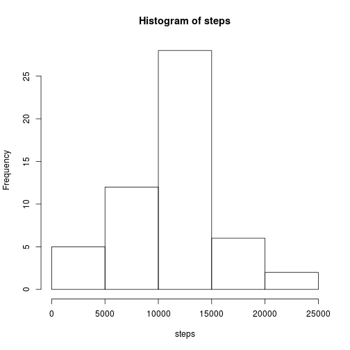
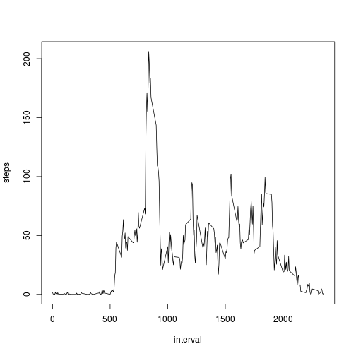
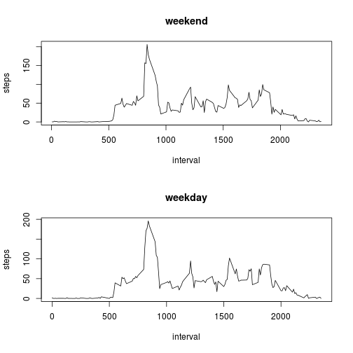

## Introduction
This document is my solution for the first project in the reproducible research course. The project gives a simple analysis for personal movement using measurement taken for one anonymous subject during the months of october and november of 2012.

The document will use the following code:


```r
library("dplyr")
```

## Loading the data
The data is a simple csv file, with the columns beings steps (numeric), date(date) and interval(numeric). We load the data and cast it into it's appropriate type by using the following code:

```r
theData<-read.csv("activity.csv",stringsAsFactors=FALSE,header=TRUE)
theData[,2]=as.Date(theData[,2])
```

In some of the sections, we will ignore all the "NA" values, and therefore we will use the partial data set "noNaData":

```r
noNaData<-theData[complete.cases(theData),]
```

## What is mean total number of steps taken per day?
We group the steps according to the date. We plot the results, and display the mean and media

```r
stepsByDay<-noNaData%>%group_by(date)%>%summarise(steps=sum(steps))
hist(stepsByDay$steps, main="Histogram of steps",xlab="steps")
```

 

We can easily calculate the mean and median accordingly by

```r
mean(stepsByDay$steps)
```

```
## [1] 10766.19
```

```r
median(stepsByDay$steps)
```

```
## [1] 10765
```
## What is the average daily activity pattern?
We group the steps according to the interval.

```r
stepsByInterval<-noNaData%>%group_by(interval)%>%summarise(steps=mean(steps))
plot(stepsByInterval$interval, stepsByInterval$steps,type="l",xlab="interval",ylab="steps")
```

 

Clearly the maximum is around the 850, and when we look for the maximum value,

```r
theMaximum<-stepsByInterval$interval[which.max(stepsByInterval$steps)]
```
we indeed find that the maximum is 835.

## Inputing missing values
So far, we addretssed the dataset without any NA values. We calculate the total number of missing values, by

```r
sum(!complete.cases(theData))
```

```
## [1] 2304
```
We can easily see that the NA values are all in the steps column. We will try to complete our knowledge by setting any NA value to be the average of that number of steps accross all other days in the same interval. That way, adding the data won't affect the average of the data. As the mean is pretty close to the median in the original data, we expect the median to rise to a value closer to the mean (or maybe the mean itself).

As the intervals are given in jumps of 5, we can get the index of the interval n in the dataset 'stepsByInterval' by using the formula (n%%100 + floor(n/100)*60)/5+1.

```r
theNAs<-!complete.cases(theData)
x<-theData[theNAs,]$interval
theIntervalsToGet<-(x%%100+floor(x/100)*60)/5+1
approxData<-theData
approxData[theNAs,]$steps=stepsByInterval[theIntervalsToGet,]$steps
```
From now on, we can use the approxData which doesn't have any NA values.

We proceed to show a plot of the steps by day, as well as the mean and median data of our new approxData.

```r
approxStepsByDay<-approxData%>%group_by(date)%>%summarise(steps=sum(steps))
hist(approxStepsByDay$steps, main="Histogram of steps",xlab="steps")
```

 

We can easily calculate the mean and median accordingly by

```r
mean(approxStepsByDay$steps)
```

```
## [1] 10766.19
```

```r
median(approxStepsByDay$steps)
```

```
## [1] 10766.19
```

Some comments are in order. As each day either had values or was entirely NA, the values, the sum of steps in each day with a missing value is exactly the mean of the steps in each day, in the original data.
Therefore exactly one column in the histogram was changed from the original data to the approximated data.
The mean of the entire data was not change, but as now more values add exactly the mean, the median was changed to the mean, as expected.
 
## Are there differences in activity patterns between weekdays and weekends?

In order for the code to behave in the same manner everywhere, we first set the culture by:

```r
Sys.setlocale("LC_TIME", "C")
```

We proceed by adding a value to approxData that is true if, and only if, the day of the week (by the date column) is either saturday or sunday:

```r
weekdaysFactor = factor(c("weekday","weekend"))
dayOfWeek = weekdays(approxData$date)
approxData$weekend<-weekdaysFactor[(dayOfWeek=="Sunday" | dayOfWeek=="Saturday")+1]
```

And we now plot the results side by side

```r
par(mfrow=c(2,1))
stepsByIntervalAndWeekend<-approxData%>%group_by(interval,weekend)%>%summarise(steps=mean(steps))
isWeekend<-stepsByIntervalAndWeekend$weekend=="weekend"
plot(stepsByInterval$interval[isWeekend], stepsByInterval$steps[isWeekend],type="l",main="weekend",xlab="interval",ylab="steps")
plot(stepsByInterval$interval[!isWeekend], stepsByInterval$steps[!isWeekend],type="l",main="weekday",xlab="interval",ylab="steps")
```

 

